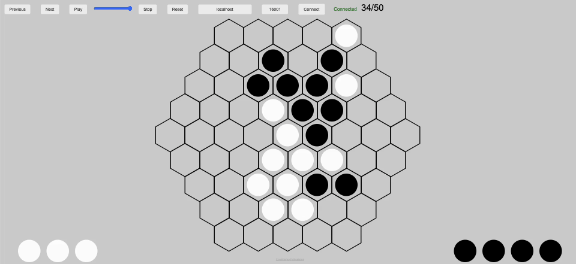

# Artificial Intelligence Agent for the Game Abalone



## Introduction

This project was developed as part of the INF8175 course - Methods and Algorithms in Artificial Intelligence at Polytechnique Montréal. It focuses on the famous board game Abalone. Abalone is a 1v1 game where each player has initially the same number of marbles on the board. The goal to win is to kick 6 of the opponent's marbles out of the board. This project aims to design and create an artificial intelligence model (called an agent) capable of playing Abalone and making rational decisions.

The algorithm used is Minimax, enhanced with various optimizations.

For more information about the optimization choices, please refer to the final report `Rapport final.pdf` (written in French).

## Files structure

The code is located in the `src` folder. The `tests` folder contains files used for optimizing the heuristic function.

The files labeled with `[*]` were provided initially by the course and implement the seahorse environment. I did not modify them.


```
├── Rapport final.pdf (Final project report)
├── src
│   ├── main_abalone.py [*] (Main file to start a game)
│   ├── my_player.py (Agent script)
│   ├── TranspositionTable.py (Class for the transposition table)
│   ├── coords.py (Contains dictionaries to convert coordinates into different bases)
│   ├── master_abalone.py [*] (Manages the game)
│   ├── game_state_abalone.py [*] (Implements the game state class)
│   ├── board_abalone.py [*] (Implements the game board class)
│   ├── player_abalone.py [*] (Implements the player class)
│   ├── GUI [*] (Files for displaying the graphical interface)
│   └── requirements.txt (Dependencies)
├── tests
│   ├── random_search.py (Random search to determine a pool of 8 configurations)
│   ├── tuning_local_search.py (Local search to optimize each configuration in the pool)
│   ├── tournament.py (Tournament to determine the best of the 8 optimized configurations)
│   ├── look_result_tournament.ipynb (Analyze the results of the tournament)
└─ README.md
```


## Execution commands

1) Navigate to the `src` directory in a terminal console using the command :
    ```
    cd src
    ```
2) Create a virtual environment :
    - Windows :
        ```
        python -m venv venv
        ..\venv\Scripts\Activate.ps1
        ```
    - Linux and MacOS
        ```
        python -m venv venv
        source venv/bin/activate
        ```
3) Install the Python dependencies :
    ```
    pip install -r requirements.txt
    ```
4) Run a game to play against the agent :
    ```
    python main_abalone.py -t human_vs_computer my_player.py
    ```

